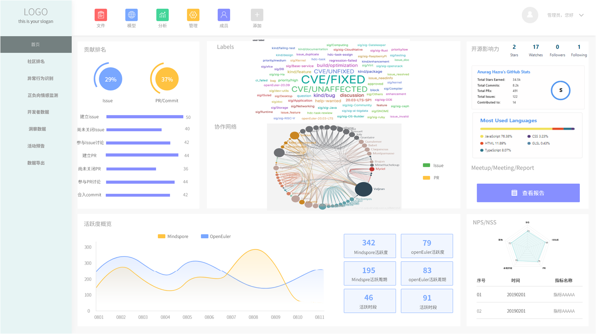
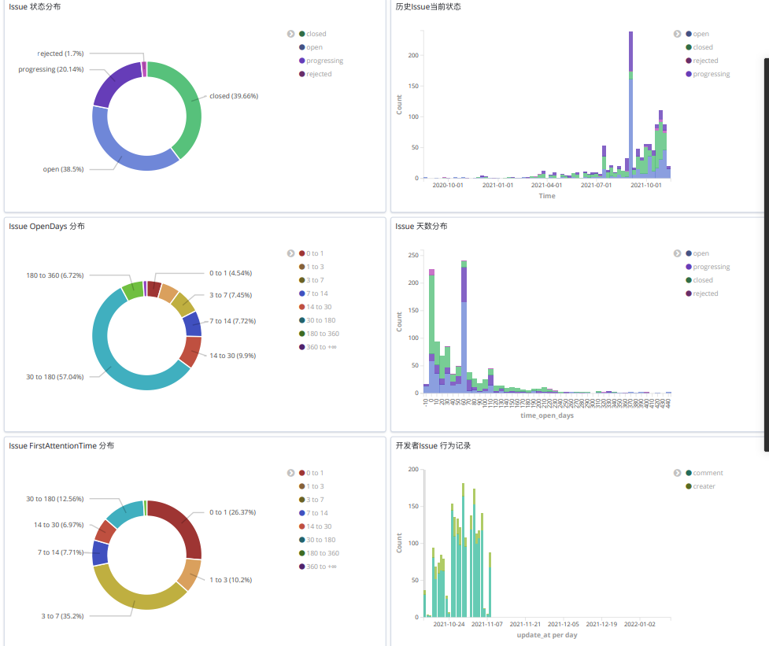

# developer-portrait

## Project setup

```shell
npm install
```

### Compiles and hot-reloads for development

```shell
npm run serve
```

### Compiles and minifies for production

```shell
npm run build
```

### Lints and fixes files

```shell
npm run lint
```

### ES

- Version: 6.8.6
- [ES SDK Client](https://www.elastic.co/guide/en/elasticsearch/client/javascript-api/6.x/index.html)
- [ES Rest API](https://www.elastic.co/guide/en/elasticsearch/reference/6.8/api-conventions.html)


## dx-platform:


## portraits examples:

